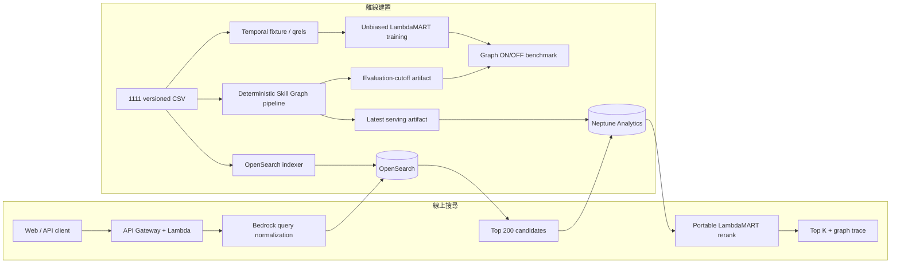

# SkillWeave

SkillWeave 是一套職缺搜尋系統。它先用 OpenSearch 從全量職缺找出候選，再透過 Skill Graph 補上同義詞和相關技能，最後交給 LambdaMART 重排。每筆結果都附有技能命中與圖譜路徑，方便查核排序理由。

- 線上展示：<https://m97uj2vc55.execute-api.us-east-1.amazonaws.com/prod/>
- 發行版本：`skillweave-2026.07.28-rc6`
- 正式環境資料量：1,218,635 筆職缺
- 正式環境圖譜：`deterministic-v2-rules-v3-latest`
- OpenAPI：[docs/openapi.yaml](docs/openapi.yaml)

## 系統架構與資料流



### 離線資料流程

1. `職缺.csv` 的 `職缺編號` 可對上搜尋曝光 `userSearchLog.empStr`、瀏覽紀錄 `職缺瀏覽.employeeNo` 和應徵紀錄 `主動應徵.empNo`。跨表使用者行為則以去識別的 `talentNo` 串接。
2. 圖譜建置分成 `DeterministicExtract → ResolveExactAliases → BuildStatisticalRelations → ExportAndValidate` 四個階段。程式掃描職缺與人工審閱過的 ontology，輸出 `Job`、`Skill`、`HAS_SKILL`，以及符合門檻的 `RELATED_TO`。正式圖譜的建置過程不使用 LLM 或 embedding。
3. 每次建置會留下兩套不可變更的資料。`evaluation-cutoff` 只使用 `2026-06-05 23:59:59.999` 以前可見的資訊，供離線評測使用；`latest` 收錄 2026-06-01～2026-06-07 的完整資料，供正式環境查詢。
4. Temporal qrels 來自搜尋、瀏覽和應徵事件。搜尋後 30 分鐘內的 view 記為 1，apply 記為 2；同一組 `(query, location, duty, job)` 只保留最高分。匿名使用者不納入，沒有互動的曝光也不直接當成負例。
5. XGBoost Unbiased LambdaMART 以固定 seed `1111` 訓練。評測範圍限於原始曝光的 Top 100；Graph OFF 沿用同一個模型，只在推論時把圖譜特徵歸零。

### 線上請求流程

1. API 先檢查 `query`、地區與職務代碼、`top_k`、`use_graph`。
2. Amazon Bedrock 把自然語言查詢整理成系統支援的職務、地點、薪資和工作型態。快取命中時直接讀取預先計算的 intent；遇到逾時或錯誤，則改用固定字彙規則解析。
3. OpenSearch 從 1,218,635 筆職缺取回 Top 200。本機精簡版使用內嵌的 12,000 筆職缺索引。
4. 開啟 Graph 時，Neptune Analytics 會解析技能別名和關聯路徑。若 Neptune 逾時，系統把圖譜特徵歸零，並把降級原因寫入 `degraded_components`。
5. Lambda 內的可攜式 LambdaMART 不需要額外套件，負責重排前 20 筆候選。回應包含職缺、命中技能、使用版本和路徑來源。

AWS 元件、IAM、延遲預算、藍綠發布與回復方式記錄在 [AWS architecture](docs/aws-architecture.md)、[deployment runbook](docs/deployment.md) 和 [graph schema](docs/graph-schema.md)。

## 環境準備

### 必要環境

- Python 3.11+
- `make`
- AWS CLI v2；呼叫 Bedrock 或部署 AWS 資源時需要有效的 AWS credentials
- 可存取 `global.anthropic.claude-haiku-4-5-20251001-v1:0` 的 Amazon Bedrock 權限
- 重跑 benchmark 時需另外安裝 `requirements-ltr.lock`，並預留衍生索引與 LTR rows 的空間
- Docker 與 AWS SAM CLI 只有在本機執行完整 OpenSearch 或 Lambda runtime smoke 時才會用到

### 建立虛擬環境

```bash
make setup
```

`make setup` 會建立 `.venv`，並依 lock file 安裝套件。如果本機展示要呼叫 Bedrock，先確認 AWS 身分：

```bash
aws login
aws sts get-caller-identity
```

常用環境變數：

| 變數 | 預設值 | 用途 |
|---|---|---|
| `AWS_REGION` | `us-east-1` | Bedrock、OpenSearch 與部署區域 |
| `BEDROCK_QUERY_MODEL_ID` | `global.anthropic.claude-haiku-4-5-20251001-v1:0` | Query normalization 模型 |
| `BEDROCK_QUERY_DEADLINE_SECONDS` | `6.0` | Query normalization 的逾時秒數 |
| `INDEX_PATH` | `artifacts/demo-index.json` | 本機內嵌索引 |
| `LTR_MODEL_PATH` | `artifacts/models/ltr-quality-final.trees.json` | 本機可攜式 LTR 模型 |
| `OPENSEARCH_ENDPOINT` | 空值 | 設定後改查完整職缺索引 |
| `OPENSEARCH_INDEX` | `skillweave-jobs-v1` | OpenSearch index 名稱 |
| `NEPTUNE_GRAPH_ID` | 空值 | Lambda 使用的 Neptune Analytics graph；未設定時改用下一層 fallback |
| `LOCAL_GRAPH_INDEX_PATH` | 空值 | 本機 SQLite 圖譜索引路徑；`NEPTUNE_GRAPH_ID` 未設定時的第二層 fallback |
| `GRAPH_VERSION` | 空值 | API 回應與發行驗證使用的圖譜版本 |
| `GRAPH_QUERY_TIMEOUT_MS` | `150` | Neptune 查詢逾時毫秒數 |

### Skill Graph 三層 fallback（不部署 AWS 也能用完整圖譜）

`app/graph_provider.py::resolve_graph_provider()` 依環境變數決定要用哪個 backend，不需要改程式碼：

1. 設定了 `NEPTUNE_GRAPH_ID` → `GraphFeatureProvider`，即時查詢 AWS Neptune Analytics（正式環境用）。
2. 沒設 `NEPTUNE_GRAPH_ID`，但 `LOCAL_GRAPH_INDEX_PATH` 指到存在的檔案 → `LocalGraphProvider`，改讀本機 SQLite 索引；內容是同一份完整的統計 `RELATED_TO` 圖譜（見「版本對照」的正式環境圖譜列），只是不需要部署 AWS。
3. 兩者都沒設 → 回退到 `artifacts/demo-index.json` 內嵌的 115-node bootstrap fixture。

沒有 AWS 帳號、只想在本機測滿版圖譜效果時，下載發行版附的索引檔並指過去即可：

```bash
python scripts/download_local_graph_index.py \
  --index-url <GitHub Release 上 skill-graph-local-index.sqlite3 的網址> \
  --sha256 <該次 release 附的 SHA-256>

export LOCAL_GRAPH_INDEX_PATH=artifacts/skill-graph-local-index.sqlite3
make demo
```

下載腳本會核對 SHA-256，檔案不符時會直接刪除並報錯，不會留下半個檔案。想自己從一次完整圖譜建置產生索引，改用 `scripts/build_local_graph_index.py`（輸入是 `run_full_graph_build.py` 的輸出）。

## 執行與 API 範例

### 本機 Web 與 API

使用 Bedrock 正規化查詢：

```bash
make demo
```

啟動後開啟 <http://127.0.0.1:8080>。如果只想檢查內嵌索引、排序和規則式 fallback，可略過啟動時的 Bedrock 連線測試：

```bash
.venv/bin/python -m app.server --port 8080
```

健康檢查與版本資訊：

```bash
curl --fail http://127.0.0.1:8080/health
curl --fail http://127.0.0.1:8080/api/v1/meta | jq
```

Graph ON 搜尋：

```bash
curl --fail --request POST \
  http://127.0.0.1:8080/api/v1/jobs/search \
  --header 'content-type: application/json' \
  --data '{
    "query": "台北 Python 後端工程師",
    "location_code": [],
    "duty_code": [],
    "top_k": 5,
    "use_graph": true
  }' | jq '{result, meta}'
```

把同一個 request 的 `use_graph` 改成 `false`，就是線上 Graph OFF。若要查看前五筆職缺的技能路徑，請改呼叫 `/api/v1/graph/trace`。主要回應欄位如下：

```json
{
  "request_id": "req_...",
  "result": [
    {
      "job_id": "...",
      "rank": 1,
      "title": "...",
      "matched_skills": ["skill.python"],
      "graph_trace": []
    }
  ],
  "meta": {
    "graph_enabled": true,
    "graph_backend": "neptune_analytics",
    "graph_version": "deterministic-v2-rules-v3-latest",
    "index_version": "demo-2026.06.07-full-v2",
    "degraded_components": []
  }
}
```

### 測試與 AWS smoke

```bash
make test       # unit + integration tests
make sam-smoke  # packaged Lambda on SAM runtime
make aws-smoke  # public production API / trace / bounded load smoke
```

部署與驗證：

```bash
aws login
bash scripts/deploy_lambda_code.sh

.venv/bin/python scripts/verify_app_deployment.py \
  --url https://m97uj2vc55.execute-api.us-east-1.amazonaws.com/prod/ \
  --require-full-corpus \
  --require-neptune \
  --expected-graph-version deterministic-v2-rules-v3-latest
```

第一次建立 stack、寫入 OpenSearch 全量索引或清理資源前，請先看 [deployment runbook](docs/deployment.md)。

## 重現 benchmark

### 1. 從原始 CSV 重跑固定版 benchmark

執行前，確認 `data/dataset/` 內有這六個檔案：`職缺.csv`、`職務對照表.csv`、`城市對照表.csv`、`userSearchLog_20260601_20260607.csv`、`職缺瀏覽_20260601_20260607.csv`、`主動應徵_0601-0607.csv`。行為資料含有假名化識別碼，請勿放進公開 artifact。

接著清理搜尋日誌並核對輸入指紋。清理會移除 SEO spam 與 URL 查詢，產生
`userSearchLog_cleaned.csv`；benchmark fixture 與展示索引都只讀這份清理後的日誌，
所以這一步是必要的，不是選用的：

```bash
make clean-search-log
make verify-inputs
```

`make verify-inputs` 比對 `config/dataset-fingerprints.json` 記錄的 SHA-256、大小與
行數。因為 pipeline 是決定性的，輸入相同就會產生位元相同的圖譜與 benchmark 產物，
所以版控只追蹤指紋，不散布數十 GB 的衍生檔案。指紋不符時代表你的產物無法與團隊
比對，先解決差異再建置。

```bash
make setup
.venv/bin/python -m pip install -r requirements-ltr.lock

DATA_DIR=data/dataset \
WORK_DIR=artifacts/quality \
make quality
```

腳本會建立 primary fixture 和 grouped LTR rows，以固定超參數訓練並比較 Graph OFF/ON。它也會輸出可攜式模型、檢查推論結果是否一致，最後用互不重疊的 hash bucket 再跑一次 replication。輸出檔案如下：

- `reports/ltr-quality-confirmation.json`：primary bucket `[2400, 3400)`，1,991 queries
- `reports/ltr-quality-replication.json`：replication bucket `[3400, 4400)`，1,992 queries
- `reports/verify-quality-release.json`：兩組至少 +5% 且 paired CI95 大於 0 的 gate
- `artifacts/models/ltr-quality-final.{ubj,trees.json,manifest.json}`

```bash
jq '{
  metadata: {queries: .metadata.queries, seed: .metadata.random_seed},
  graph_off: .baseline_no_graph,
  graph_on: .skill_graph,
  relative_lift,
  paired_bootstrap_ndcg,
  release_gates
}' reports/ltr-quality-confirmation.json

jq . reports/verify-quality-release.json
```

### 2. 重現文末的 deterministic-v3 固定結果

文末表格使用 `evaluation-cutoff` graph manifest，qrels 與模型也已固定。這些產物由上一節的
`make quality` 與下方的 overlay 步驟產生（`artifacts/` 下的評測目錄不進版控，需在本機重建）。
先核對四個 artifact 的 SHA-256：

```bash
shasum -a 256 \
  artifacts/quality/primary/overlay-index.json \
  artifacts/quality/primary/temporal-eval.json \
  artifacts/quality/primary/ltr-overlay/test.jsonl \
  artifacts/models/ltr-quality-final.ubj
```

四行雜湊應為以下內容，順序同上：

```text
49637f332e52f5d845c3a6f4448d7321e3f63a9da645501258679ec846ddbe5c
8471ccea48e37cca65dfe763092ab76600ed39ab27004f6253c136b0bffa8328
ca163ccbb4bab4da47fd2fd85453d38538ceb77a387af0b8bc784505681c8c17
19f6d2f031134a7e1e35d346214fb9533071f9a15c5691c9f50ed1dd83d1bdcf
```

核對完成後重新計分，並帶入圖譜來源資訊：

```bash
.venv/bin/python pipeline/evaluate_ltr.py \
  --graph-model artifacts/models/ltr-quality-final.ubj \
  --pairs artifacts/quality/primary/ltr-overlay/test.jsonl \
  --qrels artifacts/quality/primary/temporal-eval.json \
  --graph-binding-manifest artifacts/quality/primary/overlay-index.manifest.json \
  --output reports/ltr-quality-deterministic-v3-reproduced.json \
  --split test \
  --confidence-gate none

jq '{
  graph_off: .baseline_no_graph,
  graph_on: .skill_graph,
  relative_lift,
  paired_bootstrap_ndcg,
  release_gates
}' reports/ltr-quality-deterministic-v3-reproduced.json
```

若要從原始職缺重建同版本的圖譜中間檔，請使用發行版本的參數。這一步會掃描 1,218,635 筆職缺，比單純重新計分更花時間和磁碟空間：

```bash
.venv/bin/python scripts/run_full_graph_build.py \
  --work-root artifacts/skill-graph-full-v2 \
  --run-id deterministic-v2-rules-v3-full \
  --graph-version deterministic-v2-rules-v3 \
  --cutoff '2026-06-05 23:59:59.999' \
  --dry-run

.venv/bin/python scripts/run_full_graph_build.py \
  --work-root artifacts/skill-graph-full-v2 \
  --run-id deterministic-v2-rules-v3-full \
  --graph-version deterministic-v2-rules-v3 \
  --cutoff '2026-06-05 23:59:59.999'
```

圖譜完成後，重建 benchmark overlay 和 LTR rows。overlay 會把統計 `RELATED_TO` 邊綁進
`make quality` 產生的 base index，取代 ontology 內的審閱提示權重：

```bash
.venv/bin/python scripts/build_v2_ranking_overlay.py \
  --base-index artifacts/quality/primary/benchmark-index.json \
  --qrels artifacts/quality/primary/temporal-eval.json \
  --graph-manifest artifacts/skill-graph-full-v2/release/runs/deterministic-v2-rules-v3-full/evaluation-cutoff/manifest.json \
  --nodes artifacts/skill-graph-full-v2/resolved/evaluation-cutoff/nodes.jsonl \
  --resolved-jobs artifacts/skill-graph-full-v2/resolved/evaluation-cutoff/jobs.jsonl \
  --job-edges artifacts/skill-graph-full-v2/resolved/evaluation-cutoff/job-skill-edges.jsonl \
  --relation-edges artifacts/skill-graph-full-v2/relations/evaluation-cutoff/relation-edges.jsonl \
  --reviewed-ontology config/skill_ontology.seed.json \
  --output artifacts/quality/primary/overlay-index.json

.venv/bin/python pipeline/build_ltr_pairs.py \
  --index artifacts/quality/primary/overlay-index.json \
  --qrels artifacts/quality/primary/temporal-eval.json \
  --output-dir artifacts/quality/primary/ltr-overlay
```

Pipeline 會記錄每個階段的 checkpoint。只要參數沒變、輸出也完整，重跑時會略過已完成的階段。完成後請核對 graph manifest、index sidecar 和上述 SHA-256，確認產物沒有漂移。

## 版本對照

| 類型 | 目前版本／artifact | 說明 |
|---|---|---|
| 發行版本 | `skillweave-2026.07.28-rc6` | 圖譜/模型版本記錄在 `release-manifest.json` |
| 資料集 | `1111-2026-06-01_2026-06-07` | 1,218,635 筆職缺、6,139,952 次搜尋、8,241,233 次瀏覽、225,999 次應徵 |
| Schema fingerprint | `1ae7d6bfbf96c1ba` | 正式環境與展示版共用 |
| 正式環境圖譜 | `deterministic-v2-rules-v3-latest` | 1,219,438 個 nodes、7,710,984 條 edges，其中 1,218,635 個是 job nodes；805 條統計 `RELATED_TO` |
| 評測圖譜 | `deterministic-v2-rules-v3-evaluation-cutoff` | 固定的離線 benchmark 專用，不可換成 production `latest`；781 條統計 `RELATED_TO` |
| Graph manifest | `f5246fdc2fc6c1be16bb3b5827013dcb54b4fd6cd5a6d5a5a7e9999e9efab753` | Production latest 宣告的 manifest hash |
| 審閱 ontology | 115 個節點（82 Skill、33 Occupation） | `config/skill_ontology.seed.json`；ontology hash `76127e5915bfbfb3a731d0bd309a29fcf249ff7ceb20d8d391c8e49c2afc013e` |
| 內嵌展示索引 | `demo-2026.06.07-full-v2` | 收錄 12,000 筆職缺，供本機展示與 Lambda fallback 使用 |
| 正式搜尋索引 | `skillweave-jobs-v1` | OpenSearch 全量索引，共 1,218,635 筆職缺 |
| Benchmark 基礎索引 | `benchmark-2026.06.05-v1` | Temporal fixture 產生的原始索引 |
| 固定版 benchmark overlay | `benchmark-2026.06.05-v1-deterministic-v3-cutoff` | 已綁定 deterministic evaluation graph；overlay sidecar 記錄 base index、qrels 與 graph manifest 的 SHA-256 |
| 線上 LTR 模型 | `ltr-quality-remote-salary-intent` | XGBoost 3.2.0、40 trees；UBJ SHA-256 `cb07c70b…11fd` |
| Benchmark LTR 模型 | `ltr-quality-final` | XGBoost 3.2.0、`rank:ndcg`、seed 1111；UBJ SHA-256 `19f6d2f0…bdcf` |

正式環境的 serving pointer 記錄在 `artifacts/skill-graph-full-v2/release/production-manifest.json`。[Data card](docs/data-card.md) 說明資料治理、欄位缺值、join contract、資料洩漏和偏差限制；模型 manifest 則保存 features、超參數、訓練來源與 XGBoost 版本。比對 benchmark 時，dataset、qrels、index、model 和 graph manifest hash 必須全部一致。

## 專案結構與相關文件

```text
app/        API、檢索、查詢正規化、排序、圖譜存取
web/        前端
pipeline/   deterministic graph、LTR 訓練與評測、IPS
infra/      SAM、OpenSearch、Neptune、Step Functions templates
scripts/    環境設定、索引、benchmark、部署與發行驗證
artifacts/  有版本的展示索引、模型與 graph manifests
reports/    benchmark、smoke test、release gate 報告
tests/      單元與整合測試
docs/       架構、data card、schema、操作手冊
```

- [資料卡與限制](docs/data-card.md)
- [AWS 架構](docs/aws-architecture.md)
- [Skill Graph schema](docs/graph-schema.md)
- [部署與 rollback](docs/deployment.md)
- [GenAI safety](docs/genai-safety.md)

## 有無 Skill Graph 的指標差異

下表取自 `reports/ltr-quality-confirmation.json`，評測資料是 2026-06-07 保留的 1,991 筆查詢。兩組使用相同的 candidate rows、seed 1111 和 `ltr-quality-final` 模型；Graph OFF 在推論時把圖譜特徵歸零，Graph ON 則讀取 `deterministic-v2-rules-v3-evaluation-cutoff` 的 781 條統計 `RELATED_TO` 邊。

| 指標 | 無 Skill Graph | 有 Skill Graph | 絕對差異 | 相對改善 |
|---|---:|---:|---:|---:|
| NDCG@10 | 0.4469 | 0.4738 | +0.0269 | **+6.02%** |
| MRR | 0.4313 | 0.4633 | +0.0320 | **+7.43%** |
| Hit@1 | 0.2737 | 0.3084 | +0.0347 | **+12.66%** |
| Hit@10 | 0.8257 | 0.8538 | +0.0281 | **+3.41%** |
| Precision@10 | 0.1624 | 0.1726 | +0.0102 | **+6.28%** |

NDCG@10 的 paired mean delta 是 `+0.02692`，paired bootstrap CI95 為 `[+0.01633, +0.03747]`，區間不含 0。獨立的 replication bucket（`reports/ltr-quality-replication.json`，1,992 筆互不重疊的查詢、同一個 frozen model）也達到 `+5.61%`，paired CI95 `[+0.01470, +0.03521]`。`scripts/verify_quality_release.py` 的 12 項 release gate 全部通過，包括兩組都至少 +5% NDCG、所有指標不下降，以及 locked graph binding。

這份數據只代表離線 reranking ablation，不能當成線上 A/B test 或轉換率預估。Qrels 取自既有曝光資料，因此仍受 position bias 影響。
