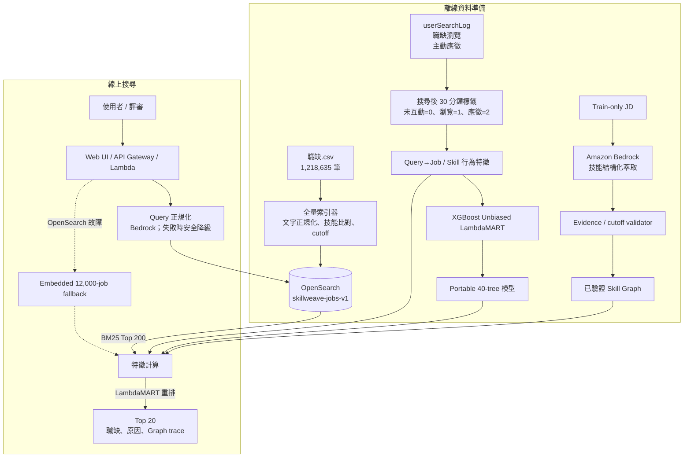

# SkillWeave

> 用全量職缺搜尋、技能圖譜與學習排序，讓求職者更快看到真正相關的工作。

SkillWeave 是為「2026 雲湧智生：臺灣生成式 AI 應用黑客松」1111 人力銀行題目打造的可解釋職缺搜尋系統。

它會先從 **1,218,635 筆職缺**找出候選，再使用 Skill Graph 與 LambdaMART 重排，最後回傳 Top 20 和推薦依據。

## 系統架構



### 一次搜尋怎麼走

```text
Query
  → Bedrock Query 正規化（不可用時 deterministic fallback）
  → OpenSearch 對 1,218,635 筆職缺做 CJK / BM25 搜尋
  → 取 Top 200
  → 計算文字、條件、Skill Graph、行為與新鮮度特徵
  → LambdaMART 重排
  → 回傳 Top 20 與 evidence trace
```

目前全量版本的 Skill Graph 特徵主要存在 OpenSearch 職缺文件與本機 artifact；Neptune、SageMaker 與 ECS 是完整 production 藍圖，不是本機全量搜尋的必要元件。

## 目前狀態

- 全量 OpenSearch 索引流程已實作，可匯入全部 **1,218,635** 筆職缺。
- OpenSearch 不可用時，API 會退回內建 **12,000** 筆 artifact，並在 response metadata 揭露降級。
- LambdaMART 使用 37 個文字、條件、圖譜、行為與 retrieval 特徵。
- Amazon Bedrock 已完成 200 筆 train-only JD pilot：180 筆通過、發布 1,598 個有原文證據的技能 mentions；尚未對全 corpus 執行 Bedrock 建圖。
- 當 `BEDROCK_QUERY_MODEL_ID` 有設定時，線上 Query 由 Bedrock Converse 正規化；失敗時使用安全 fallback。
- 已登錄的 public demo 目前仍是 compact deployment。正式全量評測必須確認 `search_scope=full_corpus_opensearch`。

Public demo：<https://38r6a90fb3.execute-api.us-east-1.amazonaws.com/prod/>

## 快速啟動

需求：Python 3.11+。Compact demo 只使用 Python 標準函式庫。

### Compact demo

```bash
python3 scripts/build_demo_index.py
python3 -m app.server --port 8080
```

開啟 <http://127.0.0.1:8080>。

### 本機全量 OpenSearch

Docker Desktop 建議配置至少 4 GB 記憶體。

```bash
make opensearch-local-up
make full-index-local
make full-demo-local
```

確認索引筆數：

```bash
curl -sS http://127.0.0.1:9200/skillweave-jobs-v1/_count
```

正確結果應為：

```json
{"count":1218635}
```

確認 API 確實走全量搜尋：

```bash
curl -sS http://127.0.0.1:8080/api/v1/meta
```

```json
{"search_scope":"full_corpus_opensearch"}
```

搜尋回應中的 metadata 也必須符合：

```json
{
  "candidate_source": "opensearch_full_corpus",
  "degraded_components": []
}
```

## API

```http
POST /api/v1/jobs/search
Content-Type: application/json
```

```json
{
  "query": "後端工程師 Node.js",
  "location_code": ["100100"],
  "duty_code": ["140200"],
  "top_k": 20,
  "use_graph": true
}
```

回應：

```json
{
  "request_id": "req_...",
  "result": [
    {
      "job_id": "132144448",
      "rank": 1,
      "title": "後端工程師(Node.js)",
      "matched_skills": ["Node.js", "後端工程師"],
      "graph_trace": []
    }
  ],
  "empStr": "132144448,...",
  "meta": {
    "candidate_source": "opensearch_full_corpus",
    "degraded_components": []
  }
}
```

API 同時相容原命題欄位 `ks`、`c0`、`d0`。完整契約見 [docs/openapi.yaml](docs/openapi.yaml)。

## 資料與防洩漏

| 資料 | 筆數 | 用途 |
|---|---:|---|
| 職缺 | 1,218,635 | 全量搜尋、職缺內容、靜態技能關係 |
| 搜尋紀錄 | 6,139,952 | Query、條件、曝光候選 |
| 職缺瀏覽 | 8,241,233 | 弱正向訊號，grade 1 |
| 主動應徵 | 225,999 | 強正向訊號，grade 2 |

本地實驗使用 `2026-06-05 23:59:59.999` 作為 graph cutoff：

- 06/01～06/05：訓練與建圖。
- 06/06：validation。
- 06/07：holdout / confirmation。
- cutoff 後職缺仍會進 OpenSearch，但不使用後來的 JD 建圖，改走 cold-start。
- 行為標籤只連結搜尋後 30 分鐘內的瀏覽或應徵。
- `talentNo=0` 不做跨事件串接；線上 API 不使用個人 ID。

詳細說明見 [docs/data-card.md](docs/data-card.md) 和 [docs/graph-schema.md](docs/graph-schema.md)。

## 離線品質

同一個 frozen model 在 Graph OFF / ON 的鎖定 confirmation 比較：

| 指標 | Graph OFF | Graph ON | 相對改善 |
|---|---:|---:|---:|
| NDCG@10 | 0.4494 | 0.4751 | **+5.72%** |
| MRR | 0.4349 | 0.4629 | **+6.45%** |
| Hit@1 | 0.2793 | 0.3054 | **+9.35%** |

第二個互斥 confirmation bucket 的 NDCG@10 仍提升 **5.07%**。這是離線相關性證據，不等於實際轉換率或營收。

完整報告見 [reports/README.md](reports/README.md)。

## 常用指令

```bash
make demo                 # Compact demo
make test                 # 編譯檢查＋單元測試
make full-demo-local      # 連接本機全量 OpenSearch
make quality              # 重建 LTR 品質實驗
make package              # 打包 Lambda
make verify               # 驗證 release evidence
```

## 專案目錄

```text
app/        API、OpenSearch retrieval、排序與 Lambda handler
web/        Live Demo
pipeline/   Bedrock 萃取、LTR 特徵、訓練與評估
scripts/    建索引、驗證、打包與部署
infra/      SAM 與 OpenSearch Serverless
artifacts/  Demo index 與 portable 模型
reports/    品質、效能與部署證據
docs/       架構、資料、安全與部署細節
tests/      API、排序、防洩漏與 release 測試
```

## 延伸文件

- [AWS 與完整 production 藍圖](docs/aws-architecture.md)
- [全量／compact 部署步驟](docs/deployment.md)
- [Skill Graph schema](docs/graph-schema.md)
- [資料卡與時間切分](docs/data-card.md)
- [Bedrock 安全與 evidence gate](docs/genai-safety.md)
- [評估報告索引](reports/README.md)

## Privacy

原始競賽 CSV、`talentNo` 與可還原個人時序的資料不可發布。公開 artifact 只保留職缺資料、版本資訊與彙總行為訊號。
