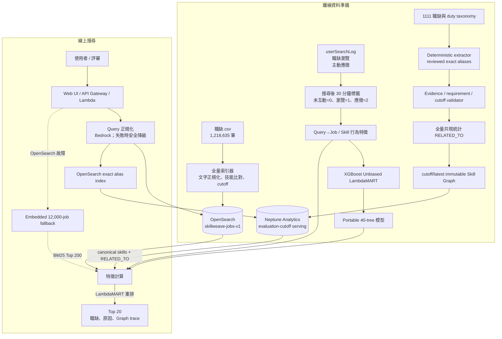

# SkillWeave

> 用全量職缺搜尋、技能圖譜與學習排序，讓求職者更快看到真正相關的工作。

SkillWeave 是為「2026 雲湧智生：臺灣生成式 AI 應用黑客松」1111 人力銀行題目打造的可解釋職缺搜尋系統。

它會先從 **1,218,635 筆職缺**找出候選，再使用 Skill Graph 與 LambdaMART 重排，最後回傳 Top 20 和推薦依據。

## 系統架構



### 一次搜尋怎麼走

```text
Query
  → 預先審閱 cache／Bedrock Query 正規化（逾時時 deterministic fallback）
  → exact alias index 解析 canonical skill，並由 Neptune Analytics 擴展 RELATED_TO
  → OpenSearch 對 1,218,635 筆職缺做 CJK / BM25 搜尋
  → 取 Top 200
  → 計算文字、條件、Neptune Skill Graph、行為與新鮮度特徵
  → LambdaMART 重排
  → 回傳 Top 20 與 evidence trace
```

本機開發預設由 Lambda／Python process 內的 embedded artifact 提供圖譜特徵；目前
judge AWS deployment 則查詢 Neptune Analytics graph `g-tew85zms65`，並回傳
`graph_backend=neptune_analytics` 與
`graph_version=deterministic-v1-rules-v2-evaluation-cutoff`。未設定
`NEPTUNE_GRAPH_ID` 或 managed graph 暫時不可用時，API 仍會安全降級而維持回應契約。

### 本機完整啟動（全量 OpenSearch + 線上 Query normalization + 前後端）

前端是 `web/` 內的靜態檔案，由 Python API 一起提供，因此不需要另外執行
`npm install`、`npm build` 或啟動第二個 frontend process。Docker Desktop 建議配置
至少 4 GB 記憶體，並預留足夠的索引空間。

第一次執行先建立 Python 環境並安裝 AWS SDK：

```bash
cd "/Users/jen/Desktop/Code/AWS Hackathon"
python3 -m venv .venv
.venv/bin/pip install -r requirements-production.lock
```

登入 AWS，並確認目前使用的是預期帳號：

```bash
aws login
aws sts get-caller-identity --query Account --output text
```

預期 Account ID：

```text
851558740348
```

啟動本機 OpenSearch：

```bash
make opensearch-local-up
```

只有全新的 Docker volume 尚未建立索引時，才執行一次全量匯入：

```bash
make full-index-local
```

索引保存在 Docker named volume；一般重啟不需要再次匯入。已有
`skillweave-jobs-v1` 時不要重跑 `make full-index-local`。

啟動整合式前端與後端，連接本機全量 OpenSearch，並使用 Bedrock 正規化 Query：

```bash
AWS_REGION=us-east-1 \
BEDROCK_QUERY_MODEL_ID=global.anthropic.claude-haiku-4-5-20251001-v1:0 \
OPENSEARCH_ENDPOINT=http://127.0.0.1:9200 \
OPENSEARCH_INDEX=skillweave-jobs-v1 \
QUERY_PREWARM_LIMIT=2000 \
.venv/bin/python -m app.server --port 8080
```

Query 正規化相關環境變數：

| 變數 | 預設 | 說明 |
|---|---|---|
| `BEDROCK_QUERY_MAX_BATCH` | `10` | 一次 Bedrock 請求最多帶幾筆查詢。Bedrock 的限制是每分鐘請求數，與單次帶幾筆無關 |
| `BEDROCK_QUERY_MAX_WAIT_SECONDS` | 長駐 `1.0` / Lambda `0.05` | 批次視窗；湊滿 batch 或等滿這個秒數就送出。`app/server.py` 預設 `1.0`（可合併併發請求），Lambda 一次 invocation 只服務一個 request、無同批夥伴，故用 `0.05` |
| `BEDROCK_QUERY_DEADLINE_SECONDS` | `6.0` | 單一 request 最多等多久；逾時回封閉字彙的 deterministic 解讀，批次仍會完成並暖 cache。實測單筆 Bedrock 呼叫約 2.1 秒，複雜查詢可達 4.6 秒 |
| `QUERY_INTENTS_PATH` | `config/query-intents.json` | 離線算好的 intent 查表，載入後放在 LRU 之外，不受執行期 miss 淘汰 |
| `QUERY_PREWARM_LIMIT` | `0`（關閉） | 啟動時背景預熱 `config/top-queries.json` 的前 N 筆。2000 筆約 6 分鐘、涵蓋 61% 搜尋量。**僅適用長駐進程**；Lambda 請改用 `QUERY_INTENTS_PATH` |
| `QUERY_PREWARM_RPM` | `45` | 預熱的請求速率上限（Bedrock quota 為 50 RPM） |

預熱與快取狀態可在 `GET /health` 的 `query_intent_cache` 觀察。

### 重建衍生資料

`config/query-intent-vocab.json`、`config/top-queries.json` 與
`artifacts/job-behavior.json` 都是從主辦方資料衍生的建置產物，不入版控：

```bash
make query-artifacts        # vocab + top-queries + job-behavior

# 頭部查詢的結構化 intent（約 5 分鐘 / 199 次 Bedrock 請求）
AWS_REGION=us-east-1 .venv/bin/python scripts/build_query_intents.py \
    --model-id global.anthropic.claude-haiku-4-5-20251001-v1:0
```

### 升級已部署的全量索引

新增欄位對 provisioned domain 是非破壞性的 mapping 更新，不需刪除索引或切換 alias：

```bash
export AWS_REGION=us-east-1
export OPENSEARCH_ENDPOINT=https://<domain-endpoint>
export OPENSEARCH_INDEX=skillweave-jobs-v1 OPENSEARCH_SERVICE=es

.venv/bin/python scripts/index_full_opensearch.py \
    --update-mapping --skip-create --batch-size 250 --max-workers 8
```

`--skip-create` 以 `_id` 就地覆寫，過程中索引持續可查詢。中斷後用
`--skip-records <最後回報的筆數>` 續傳。實測 1,218,635 筆，純索引時間約 139 分鐘
（平均 148 jobs/s，視網路狀況 124–172 jobs/s）。

`--embed` 會為每筆職缺產生 Bedrock embedding 供 hybrid kNN 使用，**預設關閉**：
它是同步逐筆呼叫，會主宰整個索引時間；且 `index.knn` 是 static setting，無法對
開啟中的索引啟用，需另建索引重灌。

開啟前端：<http://127.0.0.1:8080>。後端 API 與前端使用同一個 port：

- Health：`GET http://127.0.0.1:8080/health`
- Metadata：`GET http://127.0.0.1:8080/api/v1/meta`
- Search：`POST http://127.0.0.1:8080/api/v1/jobs/search`

確認索引筆數：

```bash
curl -sS http://127.0.0.1:9200/skillweave-jobs-v1/_count
```

正確結果應為：

```json
{"count":1218635}
```

確認 API 確實走全量搜尋：

```bash
curl -sS http://127.0.0.1:8080/api/v1/meta
```

```json
{"search_scope":"full_corpus_opensearch"}
```

搜尋回應中的 metadata 也必須符合：

```json
{
  "candidate_source": "opensearch_full_corpus",
  "degraded_components": []
}
```

預先審閱的常見查詢會直接使用 packaged cache；未快取查詢會嘗試 Bedrock，成功時
`source=amazon_bedrock`，後續相同查詢則可能為 `amazon_bedrock_cached`：

```json
{
  "query_normalization": {
    "source": "amazon_bedrock_cached",
    "model_id": "global.anthropic.claude-haiku-4-5-20251001-v1:0"
  },
  "degraded_components": []
}
```

若 Bedrock 超過 request budget，該次請求會回傳
`source=deterministic_fallback`，並在 `degraded_components` 揭露
`bedrock_query_normalizer`；背景 batch 完成後會寫入目前 Lambda 容器的 cache。

停止後端請在執行中的 terminal 按 `Ctrl-C`。停止 OpenSearch 但保留全量索引：

```bash
make opensearch-local-down
```

## AWS 完整部署：Frontend + API + Provisioned OpenSearch

以下是目前實際使用、可從零重現的 judge deployment。它會建立計費資源；評審
期間請保留，活動結束後依最下方步驟清理。

### 已部署架構與邊界

```text
Public HTTPS
  → API Gateway HTTP API
  → Lambda（同時提供 web/ frontend 與 JSON API）
      → Amazon Bedrock query normalization
      → Provisioned Amazon OpenSearch Service domain
          → skillweave-jobs-v1，1,218,635 documents
      → OpenSearch exact skill alias index
      → Neptune Analytics deterministic Skill Graph
      → Frozen portable LambdaMART reranker

Local OpenSearch index
  → FIXED-layout snapshot
  → private S3 snapshot bucket
  → provisioned OpenSearch restore
```

目前 skill graph 已匯入 Neptune Analytics，`/api/v1/graph/trace` 會回傳 grounded
evidence paths。OpenSearch 職缺文件保留 `skills`、`skill_evidence`、
`skill_confidence` 與 `skill_provenance`，供候選檢索、LTR 特徵與 managed graph
故障時的 contract-safe fallback 使用。

截至 2026-08-01 的公開 judge endpoints：

- Frontend：<https://m97uj2vc55.execute-api.us-east-1.amazonaws.com/prod/>
- Metadata：<https://m97uj2vc55.execute-api.us-east-1.amazonaws.com/prod/api/v1/meta>
- Search：<https://m97uj2vc55.execute-api.us-east-1.amazonaws.com/prod/api/v1/jobs/search>
- Graph trace：<https://m97uj2vc55.execute-api.us-east-1.amazonaws.com/prod/api/v1/graph/trace>

### 1. 安裝工具並確認 AWS identity

需要 AWS CLI v2、AWS SAM CLI、Docker Desktop、Python 3.11+、`curl` 與 `jq`。
執行 deployment 的 IAM role 至少要能操作 CloudFormation、IAM、Lambda、API
Gateway、CloudWatch、S3、Bedrock、OpenSearch Service 與 Neptune Analytics，並具有
`iam:PassRole`。

```bash
cd "/Users/jen/Desktop/Code/AWS Hackathon"
python3 -m venv .venv
.venv/bin/pip install -r requirements-production.lock

aws login
aws sts get-caller-identity
sam --version
docker --version
```

設定共用變數。`DEPLOYMENT_PRINCIPAL_ARN` 必須是 IAM role ARN，不能使用
`arn:aws:sts::...:assumed-role/...` session ARN。

```bash
export AWS_REGION=us-east-1
export APP_STACK=skillweave-demo
export SEARCH_STACK=skillweave-provisioned-search
export DOMAIN_NAME=skillweave-jobs
export INDEX_NAME=skillweave-jobs-v1
export DOCUMENT_COUNT=1218635
export SNAPSHOT_NAME=skillweave-full-fixed-2026-08-01
export DEPLOYMENT_PRINCIPAL_ARN=arn:aws:iam::123456789012:role/YourDeploymentRole
```

### 2. Bootstrap frontend/API stack

先建立不連 OpenSearch 的 Lambda stack，目的是取得穩定的 Lambda execution role。
Frontend 位於 `web/`，由 Lambda 同時提供，不需要額外建立 Amplify、CloudFront、
S3 website 或 Node build。

```bash
python3 scripts/package_lambda.py
python3 -m zipfile -t dist/skillweave-lambda.zip
sam validate --lint --template-file infra/template.yaml
sam build --template-file infra/template.yaml

sam deploy \
  --stack-name "$APP_STACK" \
  --region "$AWS_REGION" \
  --resolve-s3 \
  --capabilities CAPABILITY_IAM \
  --no-confirm-changeset \
  --no-fail-on-empty-changeset \
  --parameter-overrides \
    StageName=prod \
    ReservedConcurrency=0 \
    OpenSearchService=none \
    OpenSearchDocumentCount=0
```

取得 SAM 建立的 runtime role：

```bash
export LAMBDA_ROLE_NAME="$(aws cloudformation describe-stack-resources \
  --stack-name "$APP_STACK" \
  --region "$AWS_REGION" \
  --logical-resource-id SearchFunctionRole \
  --query 'StackResources[0].PhysicalResourceId' \
  --output text)"

export LAMBDA_ROLE_ARN="$(aws iam get-role \
  --role-name "$LAMBDA_ROLE_NAME" \
  --query 'Role.Arn' \
  --output text)"

printf '%s\n' "$LAMBDA_ROLE_ARN"
```

已經存在 `skillweave-demo` stack 時，不要另建 bootstrap stack；直接執行上面的
兩段查詢取得既有 role。

### 3. 建立 provisioned OpenSearch domain 與 snapshot bucket

目前經過 smoke test 的最小 judge 規格是 OpenSearch 3.3、單一
`m6g.large.search`、20 GiB gp3。這個配置沒有 HA，只適合 bounded hackathon demo；
正式 production 應使用多 AZ、replica、容量監控與 VPC access。

```bash
aws cloudformation deploy \
  --template-file infra/opensearch-provisioned.yaml \
  --stack-name "$SEARCH_STACK" \
  --region "$AWS_REGION" \
  --capabilities CAPABILITY_NAMED_IAM \
  --no-fail-on-empty-changeset \
  --parameter-overrides \
    DomainName="$DOMAIN_NAME" \
    EngineVersion=OpenSearch_3.3 \
    InstanceType=m6g.large.search \
    VolumeSize=20 \
    RuntimePrincipalArn="$LAMBDA_ROLE_ARN" \
    DeploymentPrincipalArn="$DEPLOYMENT_PRINCIPAL_ARN"
```

Domain 建立通常需要數十分鐘。完成後讀取 outputs：

```bash
export OPENSEARCH_ENDPOINT="$(aws cloudformation describe-stacks \
  --stack-name "$SEARCH_STACK" \
  --region "$AWS_REGION" \
  --query 'Stacks[0].Outputs[?OutputKey==`DomainEndpoint`].OutputValue | [0]' \
  --output text)"

export OPENSEARCH_DOMAIN_ARN="$(aws cloudformation describe-stacks \
  --stack-name "$SEARCH_STACK" \
  --region "$AWS_REGION" \
  --query 'Stacks[0].Outputs[?OutputKey==`DomainArn`].OutputValue | [0]' \
  --output text)"

export SNAPSHOT_BUCKET="$(aws cloudformation describe-stacks \
  --stack-name "$SEARCH_STACK" \
  --region "$AWS_REGION" \
  --query 'Stacks[0].Outputs[?OutputKey==`SnapshotBucketName`].OutputValue | [0]' \
  --output text)"

export SNAPSHOT_ROLE_ARN="$(aws cloudformation describe-stacks \
  --stack-name "$SEARCH_STACK" \
  --region "$AWS_REGION" \
  --query 'Stacks[0].Outputs[?OutputKey==`SnapshotRoleArn`].OutputValue | [0]' \
  --output text)"

printf '%s\n' \
  "$OPENSEARCH_ENDPOINT" \
  "$OPENSEARCH_DOMAIN_ARN" \
  "$SNAPSHOT_BUCKET" \
  "$SNAPSHOT_ROLE_ARN"
```

### 4. 從既有本機索引建立 FIXED snapshot

先確認本機 container 與完整 index。已有 named volume 時不要重跑全量 ingestion：

```bash
make opensearch-local-up
curl --fail-with-body -sS \
  "http://127.0.0.1:9200/$INDEX_NAME/_count" | jq
```

預期 `count` 必須精確等於 `1218635`。建立獨立的 `FIXED` repository：

```bash
docker exec skillweave-opensearch \
  mkdir -p /usr/share/opensearch/snapshots/fixed

curl --fail-with-body -sS -X PUT \
  http://127.0.0.1:9200/_snapshot/skillweave-local-fixed \
  -H 'content-type: application/json' \
  -d '{
    "type":"fs",
    "settings":{
      "location":"/usr/share/opensearch/snapshots/fixed",
      "compress":true,
      "shard_path_type":"FIXED"
    }
  }' | jq
```

建立 snapshot。`wait_for_completion=true` 只會在 snapshot 完成後返回：

```bash
curl --fail-with-body -sS -X PUT \
  "http://127.0.0.1:9200/_snapshot/skillweave-local-fixed/$SNAPSHOT_NAME?wait_for_completion=true" \
  -H 'content-type: application/json' \
  -d "{
    \"indices\":\"$INDEX_NAME\",
    \"include_global_state\":false,
    \"metadata\":{
      \"source_count\":\"$DOCUMENT_COUNT\",
      \"layout\":\"FIXED\"
    }
  }" | jq

curl --fail-with-body -sS \
  "http://127.0.0.1:9200/_snapshot/skillweave-local-fixed/$SNAPSHOT_NAME" | jq
```

最後一個結果必須是 `state=SUCCESS`、`failed=0`、`successful=1`。

不要使用 OpenSearch 3 預設的 `HASHED_PREFIX` snapshot 再直接加 S3
`base_path`；hash 會位於 base path 前方，metadata 雖可列出，restore worker 卻可能
找不到 shard blobs。此 runbook 固定使用 `FIXED` layout 避免路徑歧義。

### 5. 上傳 snapshot 到 private S3 bucket

```bash
aws s3 sync \
  snapshots/opensearch/fixed \
  "s3://$SNAPSHOT_BUCKET/fixed" \
  --only-show-errors

aws s3api list-objects-v2 \
  --bucket "$SNAPSHOT_BUCKET" \
  --prefix fixed/ \
  --query '[length(Contents),sum(Contents[].Size)]' \
  --output text
```

目前 snapshot 的已驗證結果是 101 objects、1,956,333,725 bytes。不同 index
segment merge 狀態可能產生不同 object 數與 bytes，因此真正的必要條件是後續 AWS
repository 能列出 `SUCCESS` snapshot，restore 後 `_count` 完全相同。

### 6. 在 AWS domain 註冊 repository 並 restore

OpenSearch domain 使用 IAM/SigV4，不能用未簽章的普通 `curl`。以下程式使用
`botocore` 的既有 AWS credential chain，不會把 access key 印到 terminal。

如果 target domain 已有同名 index，restore 前的 `DELETE` 會永久刪除該 AWS index。
只應在新 domain 或已確認 S3/local snapshot 完整時執行；本機 index 不受影響。

```bash
.venv/bin/python - <<'PY'
import json
import os

from scripts.index_full_opensearch import SignedOpenSearchClient

endpoint = os.environ["OPENSEARCH_ENDPOINT"]
region = os.environ["AWS_REGION"]
bucket = os.environ["SNAPSHOT_BUCKET"]
role_arn = os.environ["SNAPSHOT_ROLE_ARN"]
index = os.environ["INDEX_NAME"]
snapshot = os.environ["SNAPSHOT_NAME"]

client = SignedOpenSearchClient(endpoint, region, 60)
repository = {
    "type": "s3",
    "settings": {
        "bucket": bucket,
        "base_path": "fixed",
        "region": region,
        "role_arn": role_arn,
        "readonly": True,
        "shard_path_type": "FIXED",
    },
}
print(client.request(
    "PUT",
    "/_snapshot/skillweave-s3-fixed",
    json.dumps(repository).encode(),
))

metadata = client.request(
    "GET",
    f"/_snapshot/skillweave-s3-fixed/{snapshot}",
)
print(json.dumps(metadata, indent=2))
if metadata["snapshots"][0]["state"] != "SUCCESS":
    raise SystemExit("snapshot is not restorable")

print(client.request("DELETE", f"/{index}", acceptable=(200, 404)))
restore = {
    "indices": index,
    "include_global_state": False,
    "ignore_unavailable": False,
    "index_settings": {"index.number_of_replicas": 0},
}
print(client.request(
    "POST",
    f"/_snapshot/skillweave-s3-fixed/{snapshot}/_restore",
    json.dumps(restore).encode(),
))
PY
```

等待 restore 完成並驗證 cluster 與筆數：

```bash
.venv/bin/python - <<'PY'
import json
import os

from scripts.index_full_opensearch import SignedOpenSearchClient

client = SignedOpenSearchClient(
    os.environ["OPENSEARCH_ENDPOINT"],
    os.environ["AWS_REGION"],
    60,
)
index = os.environ["INDEX_NAME"]
health = client.request(
    "GET",
    f"/_cluster/health/{index}?wait_for_status=green&timeout=60s",
)
count = client.request("GET", f"/{index}/_count")
print(json.dumps({
    "cluster_status": health["status"],
    "unassigned_shards": health["unassigned_shards"],
    "count": count["count"],
}, indent=2))
if health["status"] != "green" or count["count"] != 1_218_635:
    raise SystemExit("OpenSearch restore verification failed")
PY
```

預期結果：`cluster_status=green`、`unassigned_shards=0`、
`count=1218635`。

### 7. 將 Lambda/API 切換到 provisioned domain

Template 參數仍名為 `OpenSearchCollectionArn`，是為了相容原本 Serverless
deployment；provisioned 模式傳入的是 domain ARN，並設定 `OpenSearchService=es`，
讓 Lambda IAM 使用 `es:ESHttpGet/Post/Head`。

在乾淨、完整的 release branch 上可使用：

```bash
AWS_REGION="$AWS_REGION" \
OPENSEARCH_ENDPOINT="$OPENSEARCH_ENDPOINT" \
OPENSEARCH_COLLECTION_ARN="$OPENSEARCH_DOMAIN_ARN" \
OPENSEARCH_INDEX="$INDEX_NAME" \
OPENSEARCH_DOCUMENT_COUNT="$DOCUMENT_COUNT" \
OPENSEARCH_SERVICE=es \
BEDROCK_QUERY_MODEL_ID=global.anthropic.claude-haiku-4-5-20251001-v1:0 \
NEPTUNE_GRAPH_ID=g-tew85zms65 \
NEPTUNE_GRAPH_REGION="$AWS_REGION" \
GRAPH_VERSION=deterministic-v1-rules-v2-evaluation-cutoff \
SKILL_ALIAS_INDEX=skillweave-skill-alias-v2-94fe982a \
./scripts/deploy_compact_aws.sh
```

此腳本會先跑完整 release gate，再執行 SAM deployment。若 release gate 已在 CI
獨立通過，也可做 targeted deployment：

```bash
python3 scripts/package_lambda.py
sam validate --lint --template-file infra/template.yaml
sam build --template-file infra/template.yaml

sam deploy \
  --stack-name "$APP_STACK" \
  --region "$AWS_REGION" \
  --resolve-s3 \
  --capabilities CAPABILITY_IAM \
  --no-confirm-changeset \
  --no-fail-on-empty-changeset \
  --parameter-overrides \
    StageName=prod \
    ReservedConcurrency=0 \
    OpenSearchEndpoint="$OPENSEARCH_ENDPOINT" \
    OpenSearchCollectionArn="$OPENSEARCH_DOMAIN_ARN" \
    OpenSearchIndex="$INDEX_NAME" \
    OpenSearchDocumentCount="$DOCUMENT_COUNT" \
    OpenSearchService=es \
    BedrockQueryModelId=global.anthropic.claude-haiku-4-5-20251001-v1:0 \
    NeptuneGraphId=g-tew85zms65 \
    NeptuneGraphRegion="$AWS_REGION" \
    GraphVersion=deterministic-v1-rules-v2-evaluation-cutoff \
    SkillAliasIndex=skillweave-skill-alias-v2-94fe982a
```

取得 public URL 並更新 release evidence：

```bash
export DEMO_URL="$(aws cloudformation describe-stacks \
  --stack-name "$APP_STACK" \
  --region "$AWS_REGION" \
  --query 'Stacks[0].Outputs[?OutputKey==`DemoUrl`].OutputValue | [0]' \
  --output text)"

python3 scripts/update_release_urls.py --aws-url "$DEMO_URL"
printf '%s\n' "$DEMO_URL"
```

### 8. Judge-facing 驗收

Metadata 必須同時揭露 embedded fallback 與正式搜尋全集，避免把 12,000 fallback
誤認為完整 corpus：

```bash
curl --fail-with-body -sS "${DEMO_URL%/}/api/v1/meta" | jq '{
  embedded_job_count,
  full_corpus_job_count,
  search_corpus_job_count,
  search_scope
}'
```

預期：

```json
{
  "embedded_job_count": 12000,
  "full_corpus_job_count": 1218635,
  "search_corpus_job_count": 1218635,
  "search_scope": "full_corpus_opensearch"
}
```

搜尋與 graph trace：

```bash
curl --fail-with-body -sS -X POST \
  "${DEMO_URL%/}/api/v1/jobs/search" \
  -H 'content-type: application/json' \
  -d '{
    "query":"後端工程師 Node.js",
    "location_code":["100100"],
    "top_k":10,
    "use_graph":true
  }' | jq '{meta,results:[.result[]|{rank,job_id,title}]}'

curl --fail-with-body -sS -X POST \
  "${DEMO_URL%/}/api/v1/graph/trace" \
  -H 'content-type: application/json' \
  -d '{"query":"AWS Docker Kubernetes","top_k":3}' | jq
```

搜尋 response 必須有：

```json
{
  "candidate_source": "opensearch_full_corpus",
  "graph_backend": "neptune_analytics",
  "graph_version": "deterministic-v1-rules-v2-evaluation-cutoff",
  "degraded_components": [],
  "ranking_model": "ltr-quality-final.ubj",
  "query_normalization": {
    "source": "amazon_bedrock_cached",
    "model_id": "global.anthropic.claude-haiku-4-5-20251001-v1:0"
  }
}
```

`query_normalization.source` 也可能是即時完成的 `amazon_bedrock`；未快取查詢若超過
request budget，則會明確標示 `deterministic_fallback` 與 degraded component。

最後跑無 AWS authentication 的 public HTTPS bounded smoke：

```bash
python3 scripts/run_aws_production_smoke.py \
  --url "$DEMO_URL" \
  --requests 30 \
  --concurrency 5 \
  --require-full-corpus \
  --require-neptune \
  --expected-graph-version deterministic-v1-rules-v2-evaluation-cutoff \
  --max-p95-ms 800

python3 scripts/build_submission_packet.py
python3 scripts/audit_submission.py
python3 scripts/verify_release.py
```

正式驗收要求 30/30 HTTP 200、30/30 Top 10、30/30
`opensearch_full_corpus`，所有 graph-on 請求都使用指定版本 Neptune Analytics，且
response metadata 的服務端 p95 小於 800 ms、沒有 client errors 或 degraded
components。2026-08-01 的最終 smoke 為 30/30、服務端 p95 `302.69 ms`；結果保存在
`reports/aws-production-smoke.json` 與 `reports/verify-release.json`。

### 9. Rollback、停止計費與保留資料

只回滾 Lambda 時，不需要刪 OpenSearch：重新部署上一個 Lambda ZIP/template，或把
OpenSearch parameters 設回空字串與 `OpenSearchService=none`，API 就會使用 embedded
fallback。

評審結束後刪除計費 stack：

```bash
aws cloudformation delete-stack \
  --stack-name "$APP_STACK" \
  --region "$AWS_REGION"
aws cloudformation wait stack-delete-complete \
  --stack-name "$APP_STACK" \
  --region "$AWS_REGION"

aws cloudformation delete-stack \
  --stack-name "$SEARCH_STACK" \
  --region "$AWS_REGION"
aws cloudformation wait stack-delete-complete \
  --stack-name "$SEARCH_STACK" \
  --region "$AWS_REGION"
```

刪除 `$SEARCH_STACK` 會永久刪除 provisioned domain 與其 restored index。
Snapshot bucket 在 template 中使用 `DeletionPolicy: Retain`，所以 stack 刪除後 S3
backup 仍存在並持續產生儲存費；確認不再需要 restore 後，才另外清空及刪除該
bucket。本機 Docker named volume 與 `snapshots/opensearch/fixed` 不會被
CloudFormation 刪除。

若帳號裡還有舊的 `skillweave-full-search` OpenSearch Serverless stack，確認
provisioned smoke 通過後再刪除，避免兩套搜尋服務重複計費：

```bash
aws cloudformation delete-stack \
  --stack-name skillweave-full-search \
  --region "$AWS_REGION"
aws cloudformation wait stack-delete-complete \
  --stack-name skillweave-full-search \
  --region "$AWS_REGION"
```

## API

```http
POST /api/v1/jobs/search
Content-Type: application/json
```

```json
{
  "query": "後端工程師 Node.js",
  "location_code": ["100100"],
  "duty_code": ["140200"],
  "top_k": 20,
  "use_graph": true
}
```

回應：

```json
{
  "request_id": "req_...",
  "result": [
    {
      "job_id": "132144448",
      "rank": 1,
      "title": "後端工程師(Node.js)",
      "matched_skills": ["Node.js", "後端工程師"],
      "graph_trace": []
    }
  ],
  "empStr": "132144448,...",
  "meta": {
    "candidate_source": "opensearch_full_corpus",
    "graph_backend": "neptune_analytics",
    "graph_version": "deterministic-v1-rules-v2-evaluation-cutoff",
    "ranking_model": "ltr-quality-final.ubj",
    "degraded_components": []
  }
}
```

API 同時相容原命題欄位 `ks`、`c0`、`d0`。完整契約見 [docs/openapi.yaml](docs/openapi.yaml)。

## 資料與防洩漏

| 資料 | 筆數 | 用途 |
|---|---:|---|
| 職缺 | 1,218,635 | 全量搜尋、職缺內容、靜態技能關係 |
| 搜尋紀錄 | 6,139,952 | Query、條件、曝光候選 |
| 職缺瀏覽 | 8,241,233 | 弱正向訊號，grade 1 |
| 主動應徵 | 225,999 | 強正向訊號，grade 2 |

本地實驗使用 `2026-06-05 23:59:59.999` 作為 graph cutoff：

- 06/01～06/05：訓練與建圖。
- 06/06：validation。
- 06/07：holdout / confirmation。
- cutoff 後職缺仍會進 OpenSearch，但不使用後來的 JD 建圖，改走 cold-start。
- 行為標籤只連結搜尋後 30 分鐘內的瀏覽或應徵。
- `talentNo=0` 不做跨事件串接；線上 API 不使用個人 ID。

詳細說明見 [docs/data-card.md](docs/data-card.md) 和 [docs/graph-schema.md](docs/graph-schema.md)。

## 離線品質

同一個 frozen model 在 Graph OFF / ON 的鎖定 confirmation 比較：

| 指標 | Graph OFF | Graph ON | 相對改善 |
|---|---:|---:|---:|
| NDCG@10 | 0.4494 | 0.4751 | **+5.72%** |
| MRR | 0.4349 | 0.4629 | **+6.45%** |
| Hit@1 | 0.2793 | 0.3054 | **+9.35%** |

第二個互斥 confirmation bucket 的 NDCG@10 仍提升 **5.07%**。這是離線相關性證據，不等於實際轉換率或營收。

完整報告見 [reports/README.md](reports/README.md)。

## 專案目錄

```text
app/        API、OpenSearch retrieval、排序與 Lambda handler
web/        Live Demo
pipeline/   Deterministic graph build、LTR 特徵、訓練與評估
scripts/    建索引、驗證、打包與部署
infra/      SAM、provisioned OpenSearch、Serverless 與 Neptune Analytics templates
artifacts/  Demo index 與 portable 模型
reports/    品質、效能與部署證據
docs/       架構、資料、安全與部署細節
tests/      API、排序、防洩漏與 release 測試
```

## 延伸文件

- [AWS 與完整 production 藍圖](docs/aws-architecture.md)
- [全量／compact 部署步驟](docs/deployment.md)
- [Skill Graph schema](docs/graph-schema.md)
- [資料卡與時間切分](docs/data-card.md)
- [Deterministic graph 安全、evidence gate 與歷史 Bedrock pilot](docs/genai-safety.md)

## 零 LLM graph build 邊界

正式離線 Skill Graph build 不呼叫任何 LLM 或 embedding API。Occupation 只由
1111 duty code taxonomy 建立；Skill 只接受 reviewed ontology 的 unique exact
alias，並保留 JD 原始 substring。未知 structured surface 會聚合到人工審閱佇列，
不會進 Neptune。技能關係只發布有門檻、無方向的 `RELATED_TO` 共現邊。

Amazon Bedrock 仍只用於線上 Query normalization，失敗時走既有 deterministic
fallback。`reports/bedrock-pilot.json` 是 200 筆舊實驗證據，不是 production graph
build，也不應與新的 cutoff/latest manifests 混用。
- [評估報告索引](reports/README.md)
