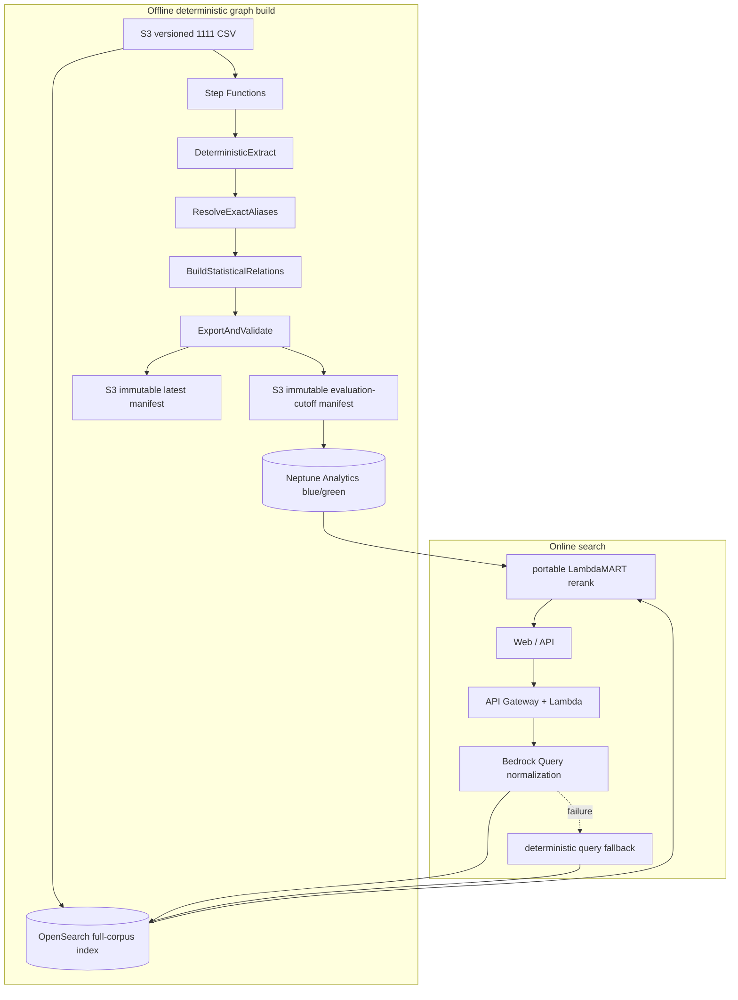

# AWS Production Architecture

## Architecture



Offline graph worker IAM 只有 S3 read/write；沒有 `bedrock:InvokeModel`。Search Lambda
保留 Bedrock permission，且只供線上 Query normalization。Neptune runtime permission
維持 read-only，query timeout 150 ms；失敗時回 graph-off 特徵並在
`degraded_components` 揭露。

## Step Functions contract

```text
DeterministicExtract
→ ResolveExactAliases
→ BuildStatisticalRelations
→ ExportAndValidate
```

Extractor 串流掃描全部 1,218,635 筆職缺，每 1,000 筆寫 immutable part，checkpoint
只在完整 part 後前進，因此 resume 與乾淨重跑 byte-identical。Manifest 記錄 input、
ontology、duty taxonomy、rules hashes、accepted/quarantine、`model_id=null`、
`llm_requests=0`。

## Online request budget

Target p95：`<800 ms`。

| Stage | p95 budget | Fallback |
|---|---:|---|
| Validate | 15 ms | reject malformed input |
| Query intent cache lookup | 1 ms | — |
| Bedrock query normalize (cache miss) | deadline `BEDROCK_QUERY_DEADLINE_SECONDS` | vocabulary-based deterministic intent; the batch still completes and warms the cache |
| OpenSearch Top 200 | 180 ms | BM25 only |
| Neptune feature aggregation | 150 ms | graph-off feature family |
| In-process LambdaMART | 120 ms | versioned linear fallback |
| Assemble / trace | 30 ms | omit optional trace details |

API response shape、`graph_backend`、`graph_version` 與 degraded fallback 維持相容。

## Query normalization

Bedrock 的限制是 **requests per minute**（Claude Haiku 4.5 為 50 RPM / 5M TPM），
與一次請求帶幾筆查詢無關。因此線上不是每個 request 打一次 Bedrock：

1. `NFKC` 正規化後查 intent cache；命中直接回（實測 13–24 µs）。
2. 未命中進 batch coalescer，湊滿 10 筆或等滿 `BEDROCK_QUERY_MAX_WAIT_SECONDS`
   （先到為準）合併成一次 Converse 請求。
3. 呼叫端只等到自己的 deadline；逾時就用封閉字彙的 deterministic 解讀作答，
   批次仍會完成並把結果寫回 cache，同一查詢下次即命中。

輸出被約束在 `職務對照表.csv` 的 690 個職務小類、`城市對照表.csv` 的縣市，以及
`職缺屬性` / `工時` / 薪資類型的封閉集合。Python 端重新驗證每個值，無法對應的
一律降級成全文比對詞，**絕不成為檢索過濾條件**。

批次視窗依部署形狀而異。Lambda 的一次 invocation 只服務一個 request，沒有可合併
的同批查詢，container 之間又會凍結，因此設 `0.05`（只用來接住同時湧入的併發），
並改以 `scripts/build_query_intents.py` 離線算好的 `config/query-intents.json` 隨
bundle 出貨（頭部 2,000 筆查詢涵蓋約 61% 搜尋量，實測命中 13–24 µs）。
`app/server.py` 這種長駐多請求進程才是批次真正有效的形狀，預設 `1.0`。

`BEDROCK_QUERY_DEADLINE_SECONDS` 為 `6.0`：實測單筆 Bedrock 呼叫約 2.1 秒，較複雜
的查詢可達 4.6 秒，過短的 deadline 會讓本來來得及的查詢被降級成 deterministic。

## Full-corpus index content

`scripts/index_full_opensearch.py` 對已部署的 provisioned index 做就地升級
（`--update-mapping --skip-create`，以 `_id` 覆寫，全程可查詢）。實測 1,218,635
筆，因網路中斷分三段續傳，純索引時間合計約 139 分鐘、平均 148 jobs/s
（單段 124–172 jobs/s；3 萬筆 benchmark 可達 222 jobs/s）。

索引後的實際覆蓋率：

| 欄位 | 覆蓋率 | 說明 |
|---|---:|---|
| `employment_type` / `education` / `experience` / `salary_type` | 100.0% | 屬性類查詢（現領／正職／兼職／工讀生）的答案來源 |
| `shifts` | 99.5% | 來自 `工時`：晚班／中班／輪班／假日班 |
| `skills` | 91.4% | 移除生產索引誤用的 graph cutoff 後，自 65.8% 提升 |
| `view_count > 0` | 23.2% | 來自 `scripts/build_job_behavior.py`，824 萬筆瀏覽 |
| `apply_count > 0` | 8.0% | 22.6 萬筆應徵 |
| post-cutoff 職缺且有技能 | 18.9% | 原本這 24% 的職缺完全沒有技能標註 |

`embedding` 欄位需要 `index.knn` 這個 **static setting**，無法對開啟中的索引啟用；
啟用 hybrid kNN 必須另建索引重灌，因此 `--embed` 維持 opt-in。

## Release and rollback

Neptune 採 blue/green import。只有 evaluation-cutoff graph 通過完整品質、locked
graph-on/off ranking、API smoke、degraded fallback、referential integrity 與 latency
gate 後，才更新小型 serving pointer。`latest` 永遠有獨立 manifest，不會被誤用於
hackathon evaluation。Rollback 只切回上一個 immutable pointer，不重建資料。

## Historical Bedrock pilot

`reports/bedrock-pilot.json` 是 200 筆舊實驗，僅保留 aggregate report 作為
失敗模式與成本證據。舊 extractor/prompt/schema 已從 production source 移除，也不授權 graph
worker 呼叫 Bedrock。Production graph relation 沒有 LLM classifier 或 embeddings。
