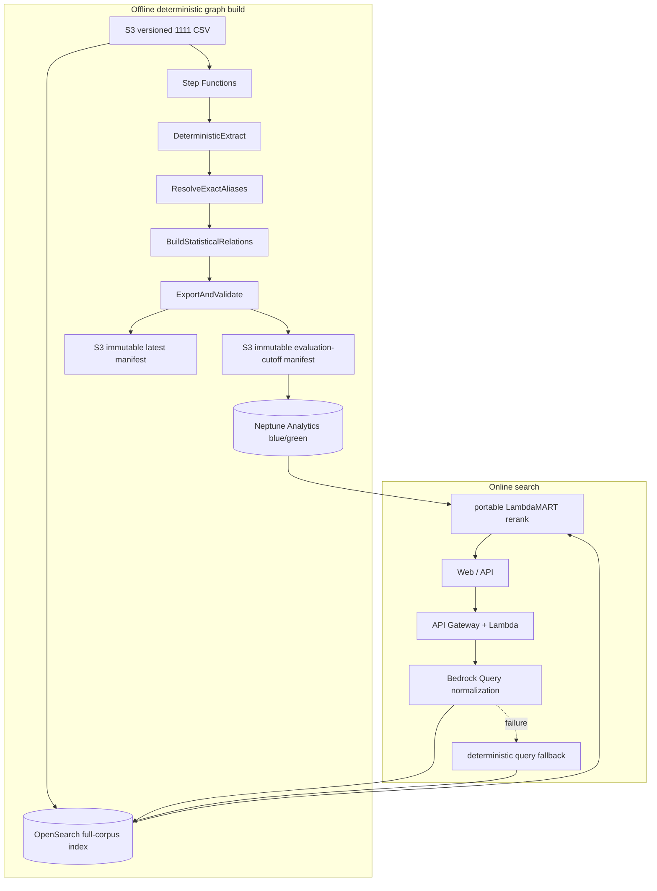

# AWS Production Architecture

## Architecture



Offline graph worker IAM 只有 S3 read/write；沒有 `bedrock:InvokeModel`。Search Lambda
保留 Bedrock permission，且只供線上 Query normalization。Neptune runtime permission
維持 read-only，query timeout 150 ms；失敗時回 graph-off 特徵並在
`degraded_components` 揭露。

## Step Functions contract

```text
DeterministicExtract
→ ResolveExactAliases
→ BuildStatisticalRelations
→ ExportAndValidate
```

Extractor 串流掃描全部 1,218,635 筆職缺，每 1,000 筆寫 immutable part，checkpoint
只在完整 part 後前進，因此 resume 與乾淨重跑 byte-identical。Manifest 記錄 input、
ontology、duty taxonomy、rules hashes、accepted/quarantine、`model_id=null`、
`llm_requests=0`。

## Online request budget

Target p95：`<800 ms`。

| Stage | p95 budget | Fallback |
|---|---:|---|
| Validate | 15 ms | reject malformed input |
| Bedrock query normalize | 350 ms | deterministic Unicode/whitespace normalization |
| OpenSearch Top 200 | 180 ms | BM25 only |
| Neptune feature aggregation | 150 ms | graph-off feature family |
| In-process LambdaMART | 120 ms | versioned linear fallback |
| Assemble / trace | 30 ms | omit optional trace details |

API response shape、`graph_backend`、`graph_version` 與 degraded fallback 維持相容。

## Release and rollback

Neptune 採 blue/green import。只有 evaluation-cutoff graph 通過完整品質、locked
graph-on/off ranking、API smoke、degraded fallback、referential integrity 與 latency
gate 後，才更新小型 serving pointer。`latest` 永遠有獨立 manifest，不會被誤用於
hackathon evaluation。Rollback 只切回上一個 immutable pointer，不重建資料。

## Historical Bedrock pilot

`reports/bedrock-pilot.json` 是 200 筆舊實驗，僅保留 aggregate report 作為
失敗模式與成本證據。舊 extractor/prompt/schema 已從 production source 移除，也不授權 graph
worker 呼叫 Bedrock。Production graph relation 沒有 LLM classifier 或 embeddings。
