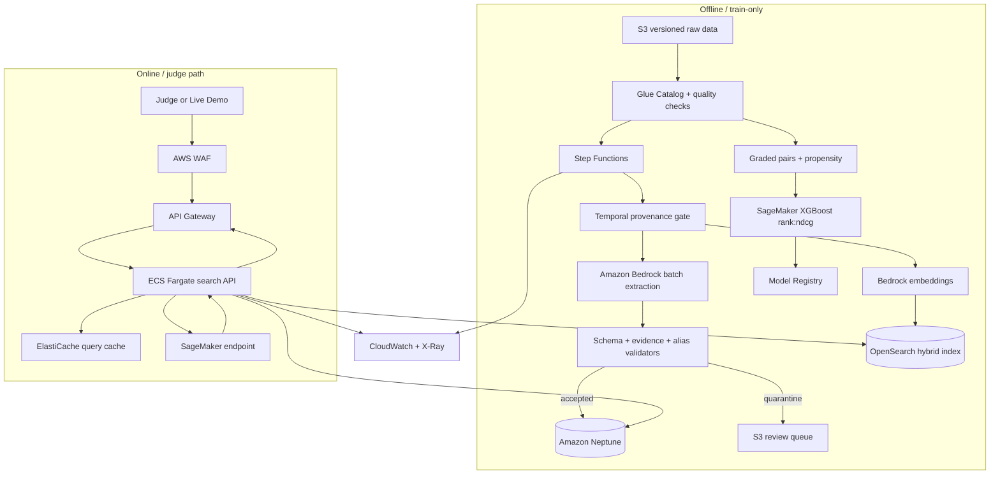

# AWS Production Architecture

## 架構圖



## Online request budget

Target p95：`<800 ms`，timeout 2.5 s。

| Stage | p95 budget | Fallback |
|---|---:|---|
| Validate | 15 ms | reject malformed input |
| Bedrock query normalize | 350 ms | deterministic Unicode/whitespace normalization |
| OpenSearch Top 200 | 180 ms | BM25 only |
| Neptune feature aggregation | 120 ms | cached / zero graph feature |
| SageMaker rerank | 120 ms | versioned in-process linear fallback |
| Assemble / trace | 30 ms | omit optional trace details |
| Network reserve | 100 ms | — |

Graph 或 model service 超時不能讓 API contract 失效；服務必須回傳合法 fallback ranking 並在 `meta.degraded_components` 揭露。

## Data and model versioning

每個 online response log（不含個資）保存：

- request ID
- query hash（短期、salt rotation）
- model/index/graph version
- candidate source
- latency breakdown
- OOV、cold-start、degraded flags

Publish 採 immutable manifest：

```json
{
  "dataset": "1111-2026-06-01_2026-06-07",
  "graph_cutoff": "2026-06-05T23:59:59.999+08:00",
  "graph": "skillgraph-v1-bedrock-...",
  "opensearch_index": "jobs-...",
  "ranker": "ltr-...",
  "prompt": "jd-skill-v3",
  "seed": 1111
}
```

只有同一 manifest 內的相容版本能一起上線。

## Security

- 所有 data/model bucket 啟用 encryption、versioning、public access block。
- Fargate、OpenSearch、Neptune、SageMaker 在 private subnets。
- API Gateway 是唯一 public ingress；WAF rate limit。
- IAM 依 task role 最小權限；online role 不具 Bedrock graph write 權限。
- Secrets Manager 管 deployment secret；repo 不放 key。
- 原始 talent ID 在 offline restricted account/role；online API 不接收也不輸出。

## Rollout

1. Shadow traffic：比較 production baseline 與 SkillWeave，不影響使用者。
2. 5% A/B：primary NDCG proxy / apply-through rate；guardrail latency、zero result、complaint。
3. 逐步 25% → 50% → 100%；每階段需通過 regression gate。
4. manifest 可一鍵切回上一版，不重建資料。

## 商業 KPI

- Search-to-view rate
- Search-to-apply rate
- Top-1 view/apply share
- First relevant click rank
- Query reformulation rate
- Zero-result / no-qualified-result rate
- 新職缺 time-to-first-qualified-view

離線 NDCG 是 release gate，不是唯一商業成功指標。

## AWS 依據

- [Amazon Bedrock structured outputs](https://docs.aws.amazon.com/bedrock/latest/userguide/structured-output.html)
- [Amazon Bedrock batch inference](https://docs.aws.amazon.com/bedrock/latest/userguide/batch-inference-create.html)
- [Amazon OpenSearch semantic enrichment / hybrid queries](https://docs.aws.amazon.com/opensearch-service/latest/developerguide/opensearch-semantic-enrichment.html)
- [Amazon Neptune openCypher](https://docs.aws.amazon.com/neptune/latest/userguide/access-graph-opencypher.html)
- [SageMaker AI XGBoost ranking support](https://docs.aws.amazon.com/sagemaker/latest/dg/xgboost.html)
- [SageMaker XGBoost NDCG tuning metric](https://docs.aws.amazon.com/sagemaker/latest/dg/xgboost-tuning.html)
- [XGBoost Learning to Rank / Unbiased LambdaMART](https://xgboost.readthedocs.io/en/release_3.2.0/tutorials/learning_to_rank.html)
- [AWS SAM HTTP API](https://docs.aws.amazon.com/serverless-application-model/latest/developerguide/sam-resource-httpapi.html)
